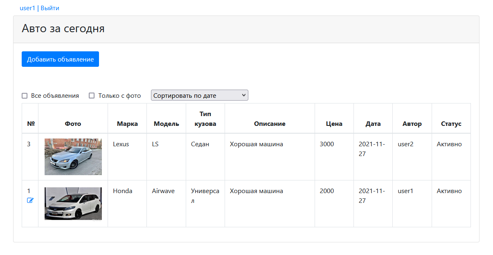
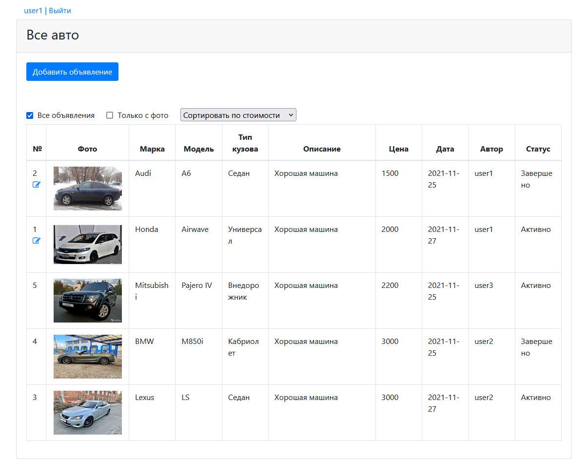
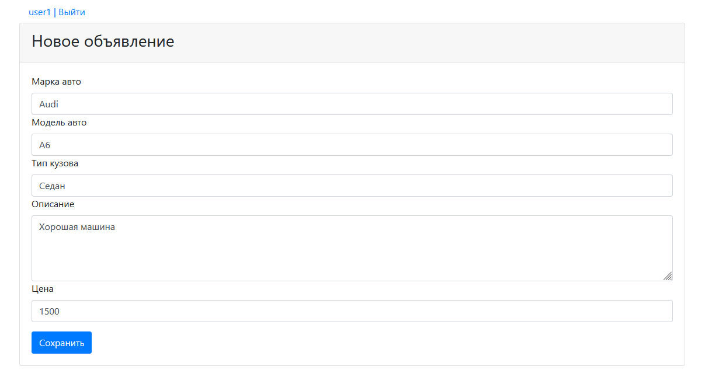
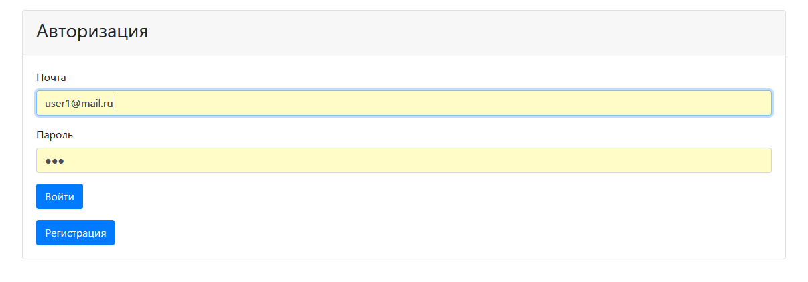

[](https://travis-ci.org/VadimShein/job4j_cars)

# <p align="center">Площадка продажи авто</p>

## Описание:
В web приложении публикуются объявления о продаже автомобилей.
Пользователь может размещать, редактировать, завершать или заного опубликовывать свои объявления после создания учетной записи и авторизации.
Также есть возможность сортировать объявления по различным параметрам.


## Используемые технологии:
* Java 13, JavaScript, jQuery
* PostgreSQL, Hibernate
* HTML, Bootstrap, CSS, JSP, JSTL
* JUnit, Mockito
* Maven, Tomcat

## Скриншоты:
1. Главная страница. Список всех актуальных объявлений.



2. Список актуальных и завершенных объявлений.



3. Создание объявления продажи авто.



4. Форма авторизации.



5. Форма регистрации.


## Запуск проекта:
1. Скопировать проект 
```
git clone https://github.com/VadimShein/job4j_cars
```

2. Создать базу данных cars и таблицы из файла src/main/resources/db/cars_users.sql

3. Выполнить сборку проекта 
```
mvn clean package -DskipTests
```

4. Запустить приложение, адрес по умолчанию  [http://localhost:8080/job4j_cars/index.jsp](http://localhost:8080/job4j_cars/index.jsp)
Получившийся после сборки проекта файл cars-1.0.war скопировать в каталог webapps Tomcat сервера. 
Выполнить настройку на веб-сервере для доступа к проекту через вебраузер.

## Контакты:
[](https://t.me/SheinVadim)
[](mailto:shein.v94@mail.ru)
